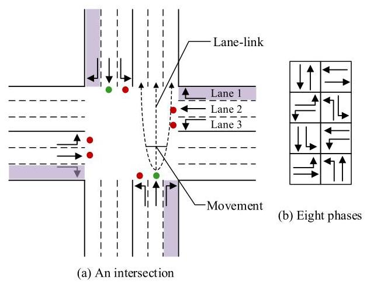
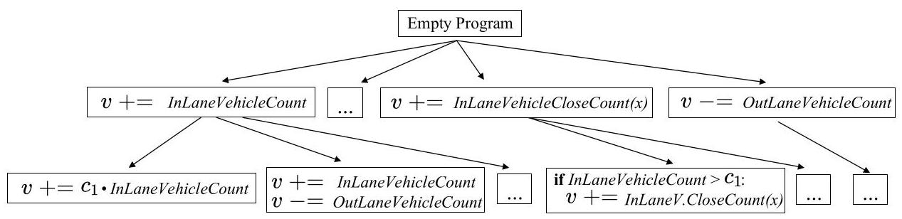
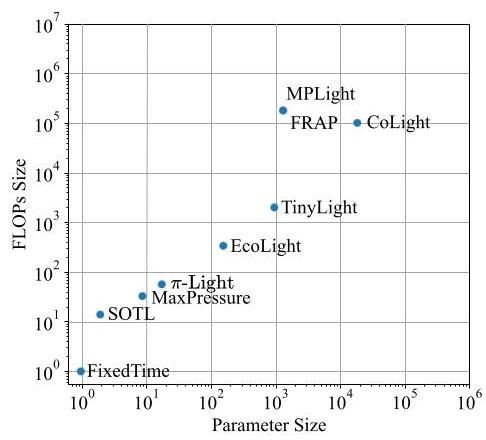
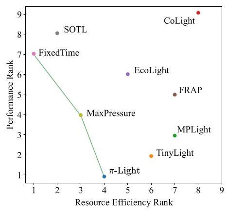

# $\pi$ -Light: Programmatic Interpretable Reinforcement Learning for Resource-Limited Traffic Signal Control

Yin ${\mathbf{{Gu}}}^{1,2}$ , Kai Zhang ${}^{1,2 * }$ , Qi Liu ${}^{1,2}$ , Weibo Gao ${}^{1,2}$ , Longfei Li ${}^{3}$ , Jun Zhou ${}^{3}$

${}^{1}$ Anhui Province Key Laboratory of Big Data Analysis and Application, School of Data Science & School of Computer Science and Technology, University of Science and Technology of China 2 State Key Laboratory of Cognitive Intelligence

3 Ant Financial Services Group

\{gy128, weibogao\}@mail.ustc.edu.cn, \{kkzhang08, qiliuql\}@ustc.edu.cn,

longyao.llf@antgroup.com, jun.zhoujun@antfin.com

## Abstract

The recent advancements in Deep Reinforcement Learning (DRL) have significantly enhanced the performance of adaptive Traffic Signal Control (TSC). However, DRL policies are typically represented by neural networks, which are over-parameterized black-box models. As a result, the learned policies often lack interpretability, and cannot be deployed directly in the real-world edge hardware due to resource constraints. In addition, the DRL methods often exhibit limited generalization performance, struggling to generalize the learned policy to other geographical regions. These factors limit the practical application of learning-based approaches. To address these issues, we suggest the use of an inherently interpretable program for representing the control policy. We present a new approach, Programmatic Interpretable reinforcement learning for traffic signal control (π-Light), designed to autonomously discover non-differentiable programs. Specifically, we define a Domain Specific Language (DSL) and transformation rules for constructing programs, and utilize Monte Carlo Tree Search (MCTS) to find the optimal program in a discrete space. Extensive experiments demonstrate that our method consistently outperforms baseline approaches. Moreover, $\pi$ -Light exhibits superior generalization capabilities compared to DRL, enabling training and evaluation across intersections from different cities. Finally, we analyze how the learned program policies can directly deploy on edge devices with extremely limited resources.

## Introduction

Traffic signal control plays a pivotal role in alleviating traffic congestion. Efficiently managing traffic flow can reduce commute times, further reducing carbon emissions. Thus, optimizing control strategies to reduce the average travel time holds significant importance. Traditional traffic signal control methods are based on expert-defined rules, such as fixed-time control (Miller 1963), SOTL (Cools, Gershen-son, and D'Hooghe 2013), and SCATS (Lowrie 1990). Although these rules offer a high degree of interpretability, their reliance on expert knowledge limits their ability to learn from data. In contrast, recent deep reinforcement learning emerges as a promising solution to TSC. In these DRL-based approaches, agents learn through continuous interactions with the environment, achieving superior performance over traditional ones. DRL methods can either be value-based (Van der Pol and Oliehoek 2016; Wei et al. 2018; Chen et al. 2020) or policy-based (Mousavi, Schukat, and Howley 2017; Oroojlooy et al. 2020), and agents at different intersections can collaborate (Wei et al. 2019) or communicate (Yu et al. 2021) to improve overall performance.

Despite the significant strides made by Deep Reinforcement Learning (DRL) methods in traffic signal control, their reliance on neural networks introduces new challenges. These challenges include a lack of interpretability, difficulty in validation, and incompatibility with edge devices. As a result, in the real world, the majority of traffic signal control methods still rely on traditional approaches (Tang et al. 2019). Even in developed countries (e.g., the United States), the proportion of intelligent traffic signals remains below 5% (Tang et al. 2019). We posit that an effective TSC approach should encompass the following three characteristics to find widespread application in real-world scenarios:

- Interpretability of policies: The formidable expressive capacity of DNNs makes the policies inherently difficult to interpret. Applying these black-box policies in high-stakes decision-making scenarios could potentially lead to unpredictable risks (Rudin 2019).

- Compatibility with edge device: Many edge devices lack effective support for neural networks. Deploying neural networks requires additional operations such as quantization (Han, Mao, and Dally 2016) to meet hardware constraints, which could inadvertently degrade performance (Krishnamoorthi 2018).

- Robust generalization capability: In this paper, we define robust generalization capability as the ability to apply a policy trained at one intersection to other regions without the need for retraining. Gathering traffic flow data for every intersection in a city proves cumbersome and sometimes unfeasible, particularly for newly constructed roads lacking sufficient traffic data. Consequently, methods should not develop specific policies for each intersection or district. Instead, they should entail devising a generalized policy that learns from a small set of intersection data and can be directly applied to all other intersections.

---

*Corresponding Author.

Copyright © 2024, Association for the Advancement of Artificial Intelligence (www.aaai.org). All rights reserved.

---

It is challenging for DRL methods in TSC to simultaneously satisfy the aforementioned three characteristics. While rule-based methods might fulfill these criteria, their inability to adaptively learn often leads to less than optimal results. In light of this, we propose employing learnable programs to represent the policy of traffic signals. To actualize this proposition, we introduce $\pi$ -Light for traffic signal control, which combines the adaptive features of RL methods with the interpretability advantages of rule-based approaches. In $\pi$ -Light, we employ a program as the policy of the agent, and the learning process will autonomously discover an effective program. A significant technical challenge in $\pi$ -Light is that the space of the program permitted is non-differentiable and can be vast due to its compositional nature. To surmount this obstacle, we have defined an effective Domain Specific Language (DSL) that includes constructs such as "If" and "Else", along with transformation rules. Subsequently, we leverage Monte Carlo Tree Search (MCTS) to explore the discrete program space, aiming to identify a well-performing program with maximal rewards. The main contributions of this work can be summarized as:

- We advocate for the representation of the agent's policy via a program, a strategy that substantially boosts the policy's interpretability and facilitates straightforward deployment on devices with resource constraints.

- To automatically discover programs, we defined the DSL and introduced a program search framework based on MCTS. This framework facilitates the exploration of good programs within a discrete program space.

- Extensive experiments on real-world datasets substantiate that $\pi$ -Light outperforms DRL-based methods. Moreover, $\pi$ -Light exhibits markedly superior generalization capabilities in comparison to DRL, as it can transfer to any regions not encountered during training. All related code has been made accessible ${}^{1}$ for future research.

## Related Work

## Traffic Signal Control

Conventional traffic signal control methods are manually crafted by domain experts. For example, the fixed-time approach switches signal phases based on predefined time intervals. MaxPressure (Varaiya 2013) method selects the phase with the highest pressure as the next phase. However, these methods are heavily dependent on specialist expertise and lack the ability to learn from data. In contrast, DRL-based methods learn from traffic flows in a trial-and-error manner to optimize their policies. FRAP (Zheng et al. 2019) effectively models the competition between phases. Attend-Light (Oroojlooy et al. 2020) utilizes attention mechanisms to handle heterogeneous intersections. MPLight (Chen et al. 2020) is designed for large-scale traffic signal control. CoL-ight (Wei et al. 2019) and MaCAR (Yu et al. 2021) explicitly consider neighbor interactions to achieve cooperation. Nevertheless, these methods primarily focus on performance, overlooking other aspects such as interpretability.

Figure 1: An illustration of the TSC problem.

Given the poor interpretability of DRL, DRSQ (Ault, Hanna, and Sharon 2020) employs a manually defined polynomial formula to represent the agent's policy. During the training process of DQN (Mnih et al. 2015), DRSQ utilizes the Q-function of DQN to optimize the parameters of the formula. However, due to the constraints imposed by the fixed formula structure, the performance of DRSQ is inferior to the DQN. Due to the slow learning speed of vanilla DRL, MetaLight (Zang et al. 2020) and GeneraLight (Zhang et al. 2020) introduced meta-RL-based approaches, which learn a well-generalized initialization from various TSC tasks to quickly adapt the learned knowledge to different intersections or traffic flows. To enable the deployment of neural policies on edge devices, certain efforts (Chauhan, Bansal, and Sen 2020; Xing et al. 2022) have been made to design lightweight network architectures tailored for TSC. For instance, TinyLight (Xing et al. 2022) prunes large super-graphs to obtain small networks. Based on the analysis above, it can be deduced that existing DRL-based work typically focuses on one or two aspects of TSC. Few studies can address the challenges of interpretability, generalization, and low resource requirements.

## Interpretable Reinforcement Learning

Recently, a number of studies have been put forward to boost the interpretability of RL (Glanois et al. 2021) by representing a policy using human-understandable languages. Several works learn policies represented by decision trees (Ernst, Geurts, and Wehenkel 2005; Bastani, Pu, and Solar-Lezama 2018; Silver et al. 2020) or programs (Verma et al. 2018, 2019; Landajuela et al. 2021). Due to the inherent complexity of directly learning programs, a common approach is learning a programmatic policy by imitating a pretrained DRL expert. For instance, Verma et al. (2018, 2019) distill DRL policies into programmatic policies. And Bastani, Pu, and Solar-Lezama (2018) learns a decision tree policy by imitating an expert neural policy for pong and cartpole tasks. These imitation-based approaches may constrain the program's performance from surpassing the expert's performance. In contrast, our method is not dependent on a trained DRL, and we learn the program policy from scratch. LEAPS (Trivedi et al. 2021) first learns a smooth program embedding space, then samples continuous vectors within this space, and obtains programs with a decoder. However, their experiment environment is limited to a simple 2D grid world. Qiu and Zhu (2022) and Paleja et al. (2022) propose differentiable algorithms for optimizing tree-like programs. Nevertheless, their program structures are not very flexible, consisting only of if-else branches and lacking sequentially executable programs.

---

${}^{1}$ https://github.com/firepd/PI-Light

---

## Traffic Term Definitions

As shown in Figure 1, we use a standard 4-way intersection to illustrate the terminologies. The intersection consists of 4 incoming roads and 4 outgoing roads. An incoming road comprises multiple incoming lanes. Similarly, an outgoing road contains multiple outgoing lanes.

A lane links consists of a pair of an incoming lane and an outgoing lane. A movement refers to a vehicle flow that starts from an incoming lane and ends at an outgoing road. A movement may contain multiple lane links. A phase $s$ corresponds to two non-conflicting movements, and a phase continues for a time interval. Changing the current phase will result in a 3-second yellow light. Lane pressure is defined as the difference between the number of vehicles in incoming lanes and outgoing lanes.

## $\pi$ -Light Method

This section presents $\pi$ -Light. We first introduce the general framework of our method. Then, we present the definition of the DSL and the transformation rules of programs. Finally, the MCTS algorithm for search programs is described.

## Overview

The distinctive feature of $\pi$ -Light is that the policies are expressed in high-level, domain specific languages. In order to ensure the interpretability of the programs and make them compact and canonical, a part of the program structure is predefined. As shown in Algorithm 1. Inspired by MaxPres-sure (Varaiya 2013), our program ${E}^{\text{ base }}$ will first calculate a priority value $v$ for each lane link (the larger the value, the higher the priority of the link). Then it will calculate the sum of the priority values corresponding to each phase, and select the phase with the highest priority as the next phase (i.e., action). Therefore, the task can be simplified to find the optimal program $E$ that computes $v$ for each lane link.

Scale to multiple intersections. A region may have multiple traffic signals to control that are located at different intersections. Instead of separately learning a program for each intersection, the found program policy ${E}^{\text{ base }}$ is shared among all the intersections.

Observation. We consider three types of features as input observations for the program ${E}^{\text{ base }}$ , which are relatively easy to obtain by traffic sensors. (1) The number of vehicles on each lane (VehicleCount). (2) The number of waiting vehicles on each lane (WaitVehicleCount). (3) The number of vehicles within $x$ meters of the intersection on each lane (VehicleCloseCount $\left( x\right)$ ). Here, $x$ is an integer parameter of the program.

Algorithm 1: Base program ${E}^{\text{ base }}$ for TSC

---

Input: Observation of one intersection

Output: next phase (action)

		for each phase $s$ do

			for each lane link (inlane, outlane) $\in  s$ do

				$v = 0$

				Execute $E$ here

			end for

			$p\left( s\right)  \leftarrow$ Sum over corresponding lane links’ $v$ .

		end for

		next phase $\leftarrow  \arg \max \{ p\left( s\right)  \mid  s \in  S\}$

---

---

Program $E \mathrel{\text{ := }} P$

					IT $\mathrel{\text{ := }}$ if $B$ then $P$

				ITE $\mathrel{\text{ := }}$ if $B$ then ${P}_{1}$ else ${P}_{2}$

						$P \mathrel{\text{ := }} \left\lbrack  {{\left( A\left| \mathbf{{IT}}\right| \mathbf{{ITE}}\right) }_{1},{\left( A\left| \mathbf{{IT}}\right| \mathbf{{ITE}}\right) }_{2},\ldots ,}\right\rbrack  .$

---

Figure 2: The domain specific language for constructing our programs. IT is a module that contain if-then structure. ITE is another module that includes if-then-else structure. A vertical bar | indicates choice. An element of P can be either $A$ , IT, or ITE.

As a lane link consists of an incoming lane and an outgoing lane, and $E$ calculates the value $\left( v\right)$ for each lane link. $E$ will receive the observation information of the corresponding incoming lane and outgoing lane. These include InLaneVehicleCount, InLaneWaitVehicleCount, and InLaneVehicle-CloseCount $\left( x\right)$ for the corresponding incoming lane, all of which are scalar values. As well as information for the outgoing lane (e.g., Out LaneVehicleCount).

Reward. The ultimate goal of TSC is to minimize the average travel time for all vehicles (Wei et al. 2021) within a finite time frame. Nevertheless, in a multi-intersection environment, existing DRL-based methods (Chen et al. 2020; Oroojlooy et al. 2020) still adopt a local metric as the reward for training agents (e.g., negative pressure on the local intersection). It is a compromise since the travel time isn't a direct function of local observation and action, hence cannot be directly optimized. However, our approach allows for the use of a global metric, because we do not use local observation to optimize the program. In practice, we utilize the reciprocal of average vehicle travel time as reward $r$ . Agents at different intersections can achieve coordination based on this reward, due to a program is shared across intersections.

## Programming Languages for Policies

In this subsection, we formally define our DSL that constructs programs. As shown in Figure 2. The DSL consists of control flows (e.g., if-then and if-then-else), condition $B$ and instruction $A.P$ is a sequentially executed program. $P$ consists of one or more modules, each of which can be $A$ , IT, or ITE. In contrast to the fixed program templates used in prior work (Verma et al. 2018), this DSL enables a flexible structure. It exhibits recursiveness, wherein the DSL permits the presence of ITE modules within its own branches.

Figure 3: An illustration of program transformation graph.

$$
B \mathrel{\text{ := }} o \leq  {c}_{1} \mid  {o}_{1} > {c}_{2}
$$

$$
A \mathrel{\text{ := }} v +  = o \mid  v +  = {c}_{1} \cdot  o
$$

$$
\left| {v -  = o}\right| v -  = {c}_{2} \cdot  o
$$

Figure 4: Definition of condition $B$ and instruction $A$ . The symbol $o$ stands for any available feature, i.e., InLaneVehicleCount. $c$ is a program parameter.

Then, we give the formal definitions of condition $B$ and instruction $A$ in Figure 4. A condition $B$ will return a boolean value. An instruction $A$ is a minimal executable unit in $E$ . For example, $v$ +=InLaneWaitVehicleCount will increase $v$ by the number of waiting vehicles. (This is intuitive, since the higher the number of waiting vehicles, the higher the priority of this incoming lane.)

Given that our primary focus is on interpretability, we do not take into account interactions between features. Furthermore, some interactions may lack practical significance (e.g., InLaneVehicleCount× InLaneWaitVehic-leCount), and hence, have been omitted by us.

## Transformation Rules

Starting with an empty program, we can construct a complex program by iteratively applying transformation rules. This process is depicted in Figure 3. Please note that in our transformation graph, the program at each node is complete and permissible according to the grammar of the DSL.

1. Add a parameter to a parameter-less $A$ . For example, $v +  = {o}_{1} \rightarrow  v +  = {c}_{1} \cdot  {o}_{1}.$

2. Add an instruction to $P$ . For example, $\left\lbrack  A\right\rbrack   \rightarrow  \left\lbrack  {A,{A}^{\prime }}\right\rbrack$ , [ITE] $\rightarrow$ [ITE, ${A}^{\prime }$ ].

3. Modify $A$ to become a branching instruction of IT module. For instance, $A \rightarrow$ if ${B}^{\prime }$ then $\left\lbrack  A\right\rbrack$ .

4. Modify $A$ to become a branching instruction of ITE module. For instance, $A \rightarrow$ if ${B}^{\prime }$ then $\left\lbrack  A\right\rbrack$ else $\left\lbrack  {A}^{\prime }\right\rbrack$ .

In the above rules, ${A}^{\prime }$ and ${B}^{\prime }$ is newly added instruction and condition, both of which are randomly generated.

## Monte Carlo Tree Search

Monte Carlo tree search (Coulom 2006) is an algorithm for searching optimal decisions within large discrete spaces represented by a search tree. MCTS has been proven to be an effective algorithm in many fields, such as AlphaGo (Silver et al. 2017) and AlphaTensor (Fawzi et al. 2022).

In $\pi$ -Light, the search tree is similar to the transformation graph shown in Figure 3. A node in the search tree represents a program, and an edge corresponds to a transformation rule. Recall that our objective is to find an optimal program that maximizes the reward. MCTS iteratively performs the following three steps, which will ultimately guide the search toward promising solutions for TSC.

1. Selection. Starting from the root node, we continuously select a child node based on a selection strategy, i.e., Upper Confidence bounds applied for Trees (UCT) (Kocsis and Szepesvári 2006) :

$$
{UCT} = r\left( j\right)  + C\sqrt{\left( \ln \left\lbrack  N\left( k\right) \right\rbrack  /N\left( j\right) \right) }
$$

where $r\left( j\right)$ is the estimated reward of a child node $j.C$ is a hyper-parameter that balances exploration and exploitation. $N\left( k\right)$ is the number of times the parent node $k$ has been visited. $N\left( j\right)$ is the number of times the child node $j$ has been visited. The UCT encourages visiting nodes with high rewards or nodes that are less visited.

2. Expansion. Expand the current node by applying available transformation rules to create child nodes. Specifically, we begin by randomly selecting an entity within the program (i.e., an $A$ or $P$ ), and then randomly apply a transformation rule to expand the entity, resulting in a new program. Since each program is complete and executable, we can evaluate the expanded node directly.

3. Backpropagation. The reward $r$ is backpropagated from the evaluated node to the root node. The update of a node’s reward follows $r\left( k\right)  \leftarrow  \max \left( {r\left( j\right) , r\left( k\right) }\right)$ . We use the max operation because we are seeking the program with the best performance, rather than average performance. In addition, we update all nodes' visit counts.

Policy Evaluation. To evaluate a program, we employ it as a control policy for a TSC environment. We run one episode of the environment, and obtain the reward (i.e., the reciprocal of average vehicle travel time) for a program.

Constant Optimization. Some programs may have parameters (e.g., $c$ and $x$ ) that need to be optimized. Since the program is non-differentiable, we are unable to compute gradients for these parameters. Following previous work (Verma et al. 2018), we use Bayesian optimization (Snoek, Larochelle, and Adams 2012) to optimize the parameters of the program aiming to maximize the reward. The number of optimization steps is between 4 and 10, depending on the number of parameters. For example, for a program with one parameter, we optimize it 4 times.

The Thirty-Eighth AAAI Conference on Artificial Intelligence (AAAI-24)

<table><tr><td rowspan="2">Methods</td><td colspan="2">Hangzhou1</td><td colspan="2">Hangzhou2</td><td colspan="2">Manhattan</td></tr><tr><td>Travel Time</td><td>Throughput</td><td>Travel Time</td><td>Throughput</td><td>Travel Time</td><td>Throughput</td></tr><tr><td>FixedTime</td><td>282.68±2.01</td><td>27.59±0.04</td><td>135.89±1.94</td><td>23.23±0.03</td><td>1062.33±16.75</td><td>16.78±0.52</td></tr><tr><td>MaxPressure</td><td>121.23±3.07</td><td>31.19±0.09</td><td>138.72±1.75</td><td>23.10±0.05</td><td>315.83±10.99</td><td>43.09±0.14</td></tr><tr><td>SOTL</td><td>250.58±3.66</td><td>28.69±0.06</td><td>136.74±2.02</td><td>23.21±0.05</td><td>984.52±17.15</td><td>19.56±1.10</td></tr><tr><td>CoLight</td><td>-</td><td>-</td><td>-</td><td>-</td><td>1713.36±33.92</td><td>2.20±0.72</td></tr><tr><td>FRAP</td><td>114.84±7.48</td><td>31.24±0.12</td><td>124.74±2.48</td><td>23.23±0.05</td><td>531.90±361.58</td><td>33.26±12.48</td></tr><tr><td>MPLight</td><td>119.58±43.37</td><td>30.96±0.96</td><td>122.55±1.75</td><td>23.24*±0.06</td><td>195.61±4.76</td><td>44.92±0.10</td></tr><tr><td>EcoLight</td><td>189.52±9.56</td><td>29.95±0.24</td><td>135.41±2.21</td><td>23.16±0.24</td><td>1014.61±33.11</td><td>17.65±0.90</td></tr><tr><td>TinyLight</td><td>102.87*±2.98</td><td>31.36*±0.05</td><td>121.00*±0.85</td><td>23.25±0.04</td><td>322.01±168.10</td><td>40.55±6.55</td></tr><tr><td>$\pi$ -Light</td><td>90.50±0.98</td><td>31.48±0.04</td><td>118.57±1.15</td><td>23.25±0.04</td><td>204.27*±0.47</td><td>44.81*±0.10</td></tr></table>

<table><tr><td rowspan="2">Methods</td><td colspan="2">Atlanta</td><td colspan="2">Jinan</td><td colspan="2">Los Angeles</td></tr><tr><td>Travel Time</td><td>Throughput</td><td>Travel Time</td><td>Throughput</td><td>Travel Time</td><td>Throughput</td></tr><tr><td>FixedTime</td><td>297.13±3.19</td><td>49.26±0.53</td><td>457.21±2.12</td><td>86.27±0.17</td><td>682.55±2.59</td><td>17.76±0.27</td></tr><tr><td>MaxPressure</td><td>261.01±4.20</td><td>59.44±1.51</td><td>340.13±1.69</td><td>94.76±0.19</td><td>588.24±22.79</td><td>23.84±1.57</td></tr><tr><td>SOTL</td><td>416.88±8.13</td><td>8.46 ±2.22</td><td>424.67 ±2.44</td><td>90.02±0.22</td><td>624.19±29.48</td><td>21.81±3.99</td></tr><tr><td>CoLight</td><td>-</td><td>-</td><td>856.53±451.3</td><td>57.96±30.08</td><td>-</td><td>-</td></tr><tr><td>FRAP</td><td>255.62±19.30</td><td>64.42±8.01</td><td>309.58±9.74</td><td>95.84±0.69</td><td>719.70±94.50</td><td>12.70±7.86</td></tr><tr><td>MPLight</td><td>248.48*±9.88</td><td>67.03*±4.41</td><td>295.23*±4.13</td><td>96.37*±0.13</td><td>577.96±81.35</td><td>23.63±6.96</td></tr><tr><td>EcoLight</td><td>306.12±24.09</td><td>47.14±8.18</td><td>379.60±5.63</td><td>92.43±0.38</td><td>650.52±11.07</td><td>19.98±0.73</td></tr><tr><td>TinyLight</td><td>253.99±8.08</td><td>62.16±3.77</td><td>310.62±3.68</td><td>95.79±0.39</td><td>489.93*±19.76</td><td>31.29*±2.73</td></tr><tr><td>$\pi$ -Light</td><td>231.22±2.55</td><td>70.41±0.72</td><td>275.06±0.54</td><td>97.03±0.11</td><td>437.42 ± 12.76</td><td>${36.14} \pm  {0.99}$</td></tr></table>

Table 1: The performance of all methods on six real-world road networks. The second best methods are denoted with *. CoLight is designed for homogeneous multi-intersection environments, therefore, some results are left blank.

Program Constraints. A concise program is easier to interpret than a complex one. To make the program easy to understand, we impose the following constraints on the transformation process of the programs. (1) The sequence length of $P$ cannot exceed 6, thus it can only have at most 6 elements. (2) The depth of program $E$ cannot exceed 2. Both the IT module and the ITE module will increase the program depth by 1 .

## Experiments

## Datasets and Simulators

To simulate realistic traffic flow, following previous works (Chen et al. 2020; Xing et al. 2022), we utilize the open-source CityFlow (Zhang et al. 2019) as our simulator. We consider six road networks from five different real-world cities, including two $1 \times  1$ road networks of Hangzhou, one ${16} \times  3$ road network of Manhattan, one $5 \times  1$ road network of Atlanta, one $4 \times  3$ road network of Jinan, and one $4 \times  1$ road network of Los Angeles. Please note that in the road networks of Atlanta and Los Angeles, intersections are heterogeneous, while intersections in the other road networks are homogeneous.

The traffic flows record the origin location, birth time $t$ , and destination of each vehicle. Both the road networks and real-world flow data were obtained from open-source repositories ${}^{2}$ . To measure the robustness of various methods to noise, for each environment, we generated nine additional traffic flows by randomly shifting the initial $t$ of all vehicles using a noise $\in  \left\lbrack  {-{60s},{60s}}\right\rbrack$ . Consequently, we need to conduct 10 independent experiments on each environment, and we report the mean performance and standard deviation.

## Baselines

We select three rule-based baselines FixedTime (Miller 1963), SOTL (Cools, Gershenson, and D'Hooghe 2013), and MaxPressure (Varaiya 2013) as baselines for comparison. Furthermore, we adopt three state-of-the-art DRL-based methods CoLight (Wei et al. 2019), FRAP (Zheng et al. 2019) and MPLight (Chen et al. 2020) that do not consider real-world deployment. Additionally, we included two DRL-based methods EcoLight (Chauhan, Bansal, and Sen 2020) and TinyLight (Xing et al. 2022) that take real-world deployment into account by utilizing lightweight network architectures to reduce hardware load.

To measure the effectiveness of each method in TSC.

---

${}^{2}$ https://github.com/DaRL-LibSignal/LibSignal

---

Listing 1: Program learned from Hangzhou2

---

v += InLaneWaitVehicleCount

v += InLaneVehicleCloseCount (150)

if (OutLaneVehicleCount>12):

	v -= OutLaneVehicleCount

---

Listing 2: Program learned from Manhattan

---

if (InLaneVehicleCount>10):

	v += InLaneWaitVehicleCount

else:

	v += InLaneVehicleCloseCount (200)

v -= OutLaneVehicleCloseCount (11)

---

We employ the average travel time of vehicles on the road network (Travel Time) and the number of vehicles passing through per minute (Throughput) as the evaluation metrics. A smaller average travel time is preferable, and a higher Throughput is better. These two metrics are widely adopted in previous studies (Chen et al. 2020; Xing et al. 2022).

## Experimental Setup

All experiments are conducted using Python on a computer with an Intel i5 13600KF CPU and an NVIDIA RTX 3050 GPU (Xi et al. 2023; Gu et al. 2021). The DRL-based baselines were implemented by PyTorch. All baselines are trained with sufficient number of episodes (i.e., 128) until convergence. Please note that though $\pi$ -Light required more episodes (e.g., 450) due to parameter optimization, its wall clock time is less than that of the baselines. For instance, in the Jinan environment, $\pi$ -Light requires 0.47 hours for a single run, while MPLight requires 0.92 hours, and TinyLight takes 3.2 hours. In addition, the hyper-parameter $C$ of the MCTS algorithm is set to 0.5 across all experiments.

## Experimental Results

The results of all methods on multiple environments are displayed in Table 1. We draw the following conclusions. When the training and evaluation environments are the same, rule-based methods are generally not as effective as learning-based methods. $\pi$ -Light exhibits the best performance, surpassing all baselines in five environments. Even in some environments (i.e., Manhattan) where $\pi$ -Light does not achieve the best score, it still ranks as the second best. In areas with complex road networks (e.g., Atlanta and Los Angeles), our method's performance exceeds the second-ranked baseline by a lot. For example, in the Los Angeles environment, the average travel time of TinyLight is 52 seconds longer than ours. It's noteworthy that our policies are mainly composed of symbolic languages, but their performance exceeds that of expressive neural policies.

## Interpretability of $\pi$ -Light

Listing 1 and Listing 2 illustrate the best programs found by $\pi$ -Light for Hangzhou and Manhattan environments, respectively. These programs are easy to understand and verify by humans compared to a DRL policy. For instance, the program from Hangzhou can be interpreted as: the priority $v$ of a lane link is equal to the number of waiting vehicles on the incoming lane plus the number of vehicles within 150 meters on the incoming lane. If the count of vehicles on the outgoing lane is greater than ${12}, v$ will be reduced by the count of vehicles on the outgoing lane. This characteristic makes them well-suited for safety-critical TSC (Du et al. 2023).

## Generalization Performance

To further validate the generalization performance of $\pi$ - Light and all baselines, we trained all approaches in the source environment and then evaluated them in the target environment. To enhance the contrast, we also report Max-Pressure, a rule-based method that requires no training.

As shown in Table 2, it can be observed that DRL performs poorly in different regions. Even transferred to neighboring intersections within the same region (i.e., Hangzhou1 $\rightarrow$ Hangzhou2), TinyLight's performance still drops a lot. When transferred to intersections in different cities (i.e., Hangzhou2 $\rightarrow$ Jinan), the performance of FRAP and MPLight significantly deteriorates, falling even below that of rule-based MaxPressure. In comparison to other DRL-based methods, EcoLight demonstrates better generalization performance, likely due to its simple network architecture that reduces its susceptibility to overfitting.

Last but not least, the generalization capability of $\pi$ -Light surpasses DRL-based methods by a substantial margin. Whether in the same region (e.g., Hangzhou1 $\rightarrow$ Hangzhou2) or different countries (e.g., Hangzhou2 $\rightarrow$ Manhattan), the performance of $\pi$ -Light remains consistently stable. This is likely attributed to the fact that the programs learned by $\pi$ -Light are not overly parameterized models. Concise programs inherently act as a form of regularization, thus resulting in superior generalization ability. Note that unlike previous meta-RL-based methods (Zang et al. 2020), $\pi$ -Light does not require further training in the target environment. Therefore, we can conclude that $\pi$ -Light trained at one intersection can transfer to other intersections without retraining.

## Resource Consumption

Following prior work (Xing et al. 2022), we selected floating-point operations (FLOPs) and memory consumption (parameter size) as metrics to evaluate resource consumption. These two metrics were chosen because they can be quantified and are independent of the microcontroller (MCU) operating environment.

Since an MCU is deployed at a single intersection, we consider the memory consumption of one policy. In real-world scenarios, a microcontroller needs to make a decision within a limited time, so we calculated the FLOPs required by a policy to make a single decision. We calculated the floating-point operations and memory consumption for each policy according to TinyLight (Xing et al. 2022), and the results are presented in Figure 5.

We notice that the resource requirements of the $\pi$ -Light policy are slightly higher than MaxPressure's. As the policy is represented in the form of a program, such programs can be readily translated into a deployment language (e.g., C language) and directly deployed onto embedded devices (Saha et al. 2023). This enables our policy to be deployed on various low-end microcontrollers, such as the 16- bit MSP430G2553 (16 MHz, 512B SRAM) ${}^{3}$ or the 8-bit AT-mega328P (8MHz, 2KB RAM) ${}^{4}$ . On the other hand, neural networks may require additional quantization steps (Han, Mao, and Dally 2016), due to MCUs often being based on 16-bit or 8-bit architectures. This further compromises the performance of DRL-based methods.

The Thirty-Eighth AAAI Conference on Artificial Intelligence (AAAI-24)

<table><tr><td rowspan="2">Methods</td><td colspan="2">Hangzhou1→Hangzhou2</td><td colspan="2">Hangzhou2→Jinan</td><td colspan="2">Hangzhou2 $\rightarrow$ Los Angeles</td></tr><tr><td>Travel Time</td><td>Throughput</td><td>Travel Time</td><td>Throughput</td><td>Travel Time</td><td>Throughput</td></tr><tr><td>MaxPressure</td><td>138.72±1.75</td><td>23.10±0.05</td><td>340.13*±1.69</td><td>94.76*±0.19</td><td>588.24*±22.79</td><td>23.84*±1.57</td></tr><tr><td>FRAP</td><td>173.75±146.11</td><td>22.48±2.25</td><td>863.99±524.35</td><td>61.04±36.02</td><td>860.70±29.59</td><td>2.73±2.75</td></tr><tr><td>MPLight</td><td>145.37±73.13</td><td>22.91±0.94</td><td>1241.03±346.95</td><td>9.26±25.87</td><td>865.16±12.61</td><td>2.30±0.95</td></tr><tr><td>EcoLight</td><td>134.60*±0.92</td><td>23.15*±0.03</td><td>404.43±25.08</td><td>92.08±1.97</td><td>739.19±81.49</td><td>11.66±7.48</td></tr><tr><td>TinyLight</td><td>703.15±316.77</td><td>14.27±4.54</td><td>-</td><td>-</td><td>-</td><td>-</td></tr><tr><td>$\pi$ -Light</td><td>119.71±1.28</td><td>23.25±0.04</td><td>278.24±5.10</td><td>96.98±0.16</td><td>478.45±33.10</td><td>30.14±5.83</td></tr></table>

<table><tr><td rowspan="2">Methods</td><td colspan="2">Manhattan $\rightarrow$ Hangzhou2</td><td colspan="2">Hangzhou2→Manhattan</td><td colspan="2">Hangzhou2→Atlanta</td></tr><tr><td>Travel Time</td><td>Throughput</td><td>Travel Time</td><td>Throughput</td><td>Travel Time</td><td>Throughput</td></tr><tr><td>MaxPressure</td><td>138.72±1.75</td><td>23.10±0.05</td><td>315.83*±10.99</td><td>43.09*±0.14</td><td>261.01*±4.20</td><td>59.44*±1.51</td></tr><tr><td>FRAP</td><td>658.66±548.66</td><td>16.07±7.51</td><td>1593.38±463.58</td><td>5.91±13.00</td><td>362.41±79.07</td><td>26.23±26.38</td></tr><tr><td>MPLight</td><td>453.89±521.87</td><td>18.70±7.20</td><td>1781.96±1.87</td><td>0.78±0.04</td><td>328.49±72.26</td><td>40.22±25.63</td></tr><tr><td>EcoLight</td><td>135.80*±1.97</td><td>23.23*±0.05</td><td>892.72±236.38</td><td>24.22±9.18</td><td>386.03±52.96</td><td>18.53±17.55</td></tr><tr><td>$\pi$ -Light</td><td>120.80±1.80</td><td>23.24±0.05</td><td>209.07±1.34</td><td>44.76±0.10</td><td>240.40±2.99</td><td>67.16±1.54</td></tr></table>

Table 2: Generalization performance. The environments on the left and right sides of the arrow correspond to the training and evaluation environments, respectively. Hangzhou1 and Hangzhou2 are single-intersection environments, while the others are multi-intersection environments. "-" indicates some methods cannot be transferred, because the action dimensions (number of phases) differ between two environments.

Figure 5: Consumption of computational and storage resources. MPLight is based on FRAP, therefore they have the same resource consumption.

We normalize and rank the performance of all methods based on Table 1, and we also rank the resource consumption for all methods. The comparison results are shown in Figure 6. Notably, our approach is situated on the Pareto frontier and stands as the sole learning-based method.

Figure 6: Comparison of performance vs. resource efficiency of all methods. The lower rank is better.

## Conclusion

In this paper, we introduce $\pi$ -Light which aims to simultaneously address three critical challenges in Traffic Signal Control (TSC): interpretability, generalization capability (i.e., robustness to environmental changes), and low resource consumption. In $\pi$ -Light, policies are represented by interpretable programs. We define the domain specific language and transformation rules to construct these programs. MCTS is employed to search for optimal program structures within the non-differentiable program space, while Bayesian optimization is utilized to fine-tune program parameters. Extensive experiments on multiple road networks with real-world traffic demands confirmed the strong performance and generalization capabilities of $\pi$ -Light. Moreover, the policy of $\pi$ -Light can be easily deployed on edge devices.

---

${}^{3}$ https://www.ti.com/product/MSP430G2553

${}^{4}$ https://www.microchip.com/en-us/product/ATmega328P

---

## Acknowledgements

This research was partially supported by grants from the National Key Research and Development Program of China (No. 2021YFF0901003) and the Anhui Provincial Natural Science Foundation of China (No. 2308085QF229). This work was also supported by Ant Group through CCF-Ant Research Fund.

## References

Ault, J.; Hanna, J. P.; and Sharon, G. 2020. Learning an Interpretable Traffic Signal Control Policy. In Proceedings of the 19th International Conference on Autonomous Agents and MultiAgent Systems, 88-96.

Bastani, O.; Pu, Y.; and Solar-Lezama, A. 2018. Verifiable reinforcement learning via policy extraction. Advances in neural information processing systems, 31.

Chauhan, S.; Bansal, K.; and Sen, R. 2020. EcoLight: Intersection control in developing regions under extreme budget and network constraints. Advances in Neural Information Processing Systems, 33: 13027-13037.

Chen, C.; Wei, H.; Xu, N.; Zheng, G.; Yang, M.; Xiong, Y.; Xu, K.; and Li, Z. 2020. Toward a thousand lights: Decentralized deep reinforcement learning for large-scale traffic signal control. In Proceedings of the AAAI Conference on Artificial Intelligence, volume 34, 3414-3421.

Cools, S.-B.; Gershenson, C.; and D'Hooghe, B. 2013. Self-organizing traffic lights: A realistic simulation. Advances in applied self-organizing systems, 45-55.

Coulom, R. 2006. Efficient selectivity and backup operators in Monte-Carlo tree search. In International conference on computers and games, 72-83. Springer.

Du, W.; Ye, J.; Gu, J.; Li, J.; Wei, H.; and Wang, G. 2023. Safelight: A reinforcement learning method toward collision-free traffic signal control. In Proceedings of the AAAI Conference on Artificial Intelligence, volume 37, 14801-14810.

Ernst, D.; Geurts, P.; and Wehenkel, L. 2005. Tree-based batch mode reinforcement learning. Journal of Machine Learning Research, 6.

Fawzi, A.; Balog, M.; Huang, A.; Hubert, T.; Romera-Paredes, B.; Barekatain, M.; Novikov, A.; R Ruiz, F. J.; Schrittwieser, J.; Swirszcz, G.; et al. 2022. Discovering faster matrix multiplication algorithms with reinforcement learning. Nature, 610(7930): 47-53.

Glanois, C.; Weng, P.; Zimmer, M.; Li, D.; Yang, T.; Hao, J.; and Liu, W. 2021. A survey on interpretable reinforcement learning. arXiv preprint arXiv:2112.13112.

Gu, Y.; Liu, Q.; Zhang, K.; Huang, Z.; Wu, R.; and Tao, J. 2021. Neuralac: Learning cooperation and competition effects for match outcome prediction. In Proceedings of the AAAI Conference on Artificial Intelligence, volume 35, 4072-4080.

Han, S.; Mao, H.; and Dally, W. J. 2016. Deep compression: Compressing deep neural networks with pruning, trained quantization and huffman coding. In International Conference on Learning Representations.

Kocsis, L.; and Szepesvári, C. 2006. Bandit based monte-carlo planning. In European conference on machine learning, 282-293. Springer.

Krishnamoorthi, R. 2018. Quantizing deep convolutional networks for efficient inference: A whitepaper. arXiv preprint arXiv:1806.08342.

Landajuela, M.; Petersen, B. K.; Kim, S.; Santiago, C. P.; Glatt, R.; Mundhenk, N.; Pettit, J. F.; and Faissol, D. 2021. Discovering symbolic policies with deep reinforcement learning. In International Conference on Machine Learning, 5979-5989. PMLR.

Lowrie, P. 1990. Scats, sydney co-ordinated adaptive traffic system: A traffic responsive method of controlling urban traffic.

Miller, A. J. 1963. Settings for fixed-cycle traffic signals. Journal of the Operational Research Society, 14(4): 373- 386.

Mnih, V.; Kavukcuoglu, K.; Silver, D.; Rusu, A. A.; Ve-ness, J.; Bellemare, M. G.; Graves, A.; Riedmiller, M.; Fidje-land, A. K.; Ostrovski, G.; et al. 2015. Human-level control through deep reinforcement learning. nature, 518(7540): 529-533.

Mousavi, S. S.; Schukat, M.; and Howley, E. 2017. Traffic light control using deep policy-gradient and value-function-based reinforcement learning. IET Intelligent Transport Systems, 11(7): 417-423.

Oroojlooy, A.; Nazari, M.; Hajinezhad, D.; and Silva, J. 2020. Attendlight: Universal attention-based reinforcement learning model for traffic signal control. Advances in Neural Information Processing Systems, 33: 4079-4090.

Paleja, R.; Niu, Y.; Silva, A.; Ritchie, C.; Choi, S.; and Gom-bolay, M. 2022. Learning Interpretable, High-Performing Policies for Autonomous Driving. In Robotics: Science and Systems (RSS).

Qiu, W.; and Zhu, H. 2022. Programmatic Reinforcement Learning without Oracles. In The Tenth International Conference on Learning Representations.

Rudin, C. 2019. Stop explaining black box machine learning models for high stakes decisions and use interpretable models instead. Nature machine intelligence, 1(5): 206-215.

Saha, S. S.; Sandha, S. S.; Aggarwal, M.; Wang, B.; Han, L.; Briseno, J. d. G.; and Srivastava, M. 2023. TinyNS: Platform-Aware Neurosymbolic Auto Tiny Machine Learning. ACM Transactions on Embedded Computing Systems.

Silver, D.; Schrittwieser, J.; Simonyan, K.; Antonoglou, I.; Huang, A.; Guez, A.; Hubert, T.; Baker, L.; Lai, M.; Bolton, A.; et al. 2017. Mastering the game of go without human knowledge. nature, 550(7676): 354-359.

Silver, T.; Allen, K. R.; Lew, A. K.; Kaelbling, L. P.; and Tenenbaum, J. 2020. Few-shot bayesian imitation learning with logical program policies. In Proceedings of the AAAI Conference on Artificial Intelligence, volume 34, 10251- 10258.

Snoek, J.; Larochelle, H.; and Adams, R. P. 2012. Practical bayesian optimization of machine learning algorithms. Advances in neural information processing systems, 25.

Tang, K.; Boltze, M.; Nakamura, H.; and Tian, Z. 2019. Global practices on road traffic signal control: Fixed-time control at isolated intersections. Elsevier.

Trivedi, D.; Zhang, J.; Sun, S.-H.; and Lim, J. J. 2021. Learning to synthesize programs as interpretable and generalizable policies. Advances in neural information processing systems, 34: 25146-25163.

Van der Pol, E.; and Oliehoek, F. A. 2016. Coordinated deep reinforcement learners for traffic light control. Proceedings of learning, inference and control of multi-agent systems (at NIPS 2016), 8: 21-38.

Varaiya, P. 2013. The max-pressure controller for arbitrary networks of signalized intersections. In Advances in dynamic network modeling in complex transportation systems, 27-66. Springer.

Verma, A.; Le, H.; Yue, Y.; and Chaudhuri, S. 2019. Imitation-projected programmatic reinforcement learning. Advances in Neural Information Processing Systems, 32.

Verma, A.; Murali, V.; Singh, R.; Kohli, P.; and Chaud-huri, S. 2018. Programmatically interpretable reinforcement learning. In International Conference on Machine Learning, 5045-5054. PMLR.

Wei, H.; Xu, N.; Zhang, H.; Zheng, G.; Zang, X.; Chen, C.; Zhang, W.; Zhu, Y.; Xu, K.; and Li, Z. 2019. Colight: Learning network-level cooperation for traffic signal control. In Proceedings of the 28th ACM International Conference on Information and Knowledge Management, 1913-1922.

Wei, H.; Zheng, G.; Gayah, V.; and Li, Z. 2021. Recent advances in reinforcement learning for traffic signal control: A survey of models and evaluation. ACM SIGKDD Explorations Newsletter, 22(2): 12-18.

Wei, H.; Zheng, G.; Yao, H.; and Li, Z. 2018. Intellilight: A reinforcement learning approach for intelligent traffic light control. In Proceedings of the 24th ACM SIGKDD International Conference on Knowledge Discovery & Data Mining, 2496-2505.

Xi, W.; Song, X.; Guo, W.; and Yang, Y. 2023. Robust Semi-Supervised Learning for Self-learning Open-World Classes. In ICDM. Shanghai, China.

Xing, D.; Zheng, Q.; Liu, Q.; and Pan, G. 2022. TinyLight: Adaptive Traffic Signal Control on Devices with Extremely Limited Resources. In IJCAI, 3999-4005. ijcai.org.

Yu, Z.; Liang, S.; Wei, L.; Jin, Z.; Huang, J.; Cai, D.; He, X.; and Hua, X.-S. 2021. MaCAR: Urban traffic light control via active multi-agent communication and action rectification. In Proceedings of the Twenty-Ninth International Conference on International Joint Conferences on Artificial Intelligence, 2491-2497.

Zang, X.; Yao, H.; Zheng, G.; Xu, N.; Xu, K.; and Li, Z. 2020. Metalight: Value-based meta-reinforcement learning for traffic signal control. In Proceedings of the AAAI Conference on Artificial Intelligence, volume 34, 1153-1160.

Zhang, H.; Feng, S.; Liu, C.; Ding, Y.; Zhu, Y.; Zhou, Z.; Zhang, W.; Yu, Y.; Jin, H.; and Li, Z. 2019. Cityflow: A multi-agent reinforcement learning environment for large scale city traffic scenario. In The world wide web conference, 3620-3624.

Zhang, H.; Liu, C.; Zhang, W.; Zheng, G.; and Yu, Y. 2020. Generalight: Improving environment generalization of traffic signal control via meta reinforcement learning. In Proceedings of the 29th ACM International Conference on Information & Knowledge Management, 1783-1792.

Zheng, G.; Xiong, Y.; Zang, X.; Feng, J.; Wei, H.; Zhang, H.; Li, Y.; Xu, K.; and Li, Z. 2019. Learning phase competition for traffic signal control. In Proceedings of the 28th ACM international conference on information and knowledge management, 1963-1972.